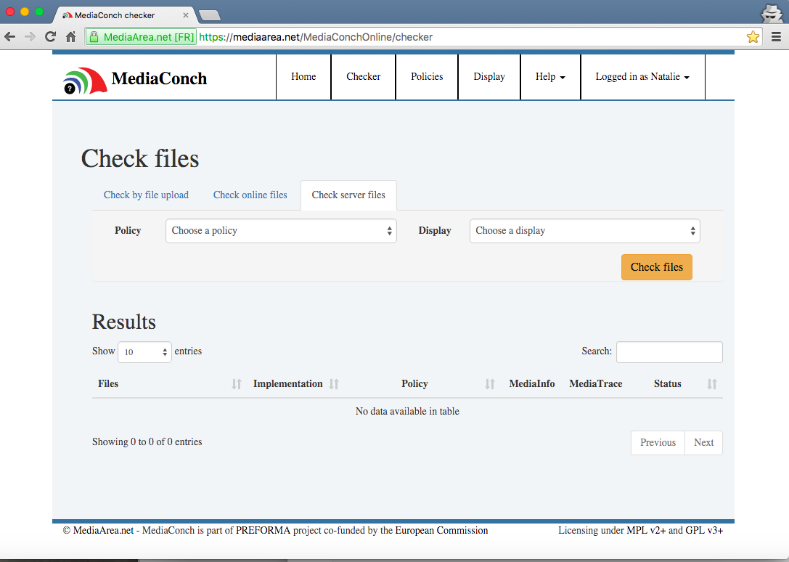
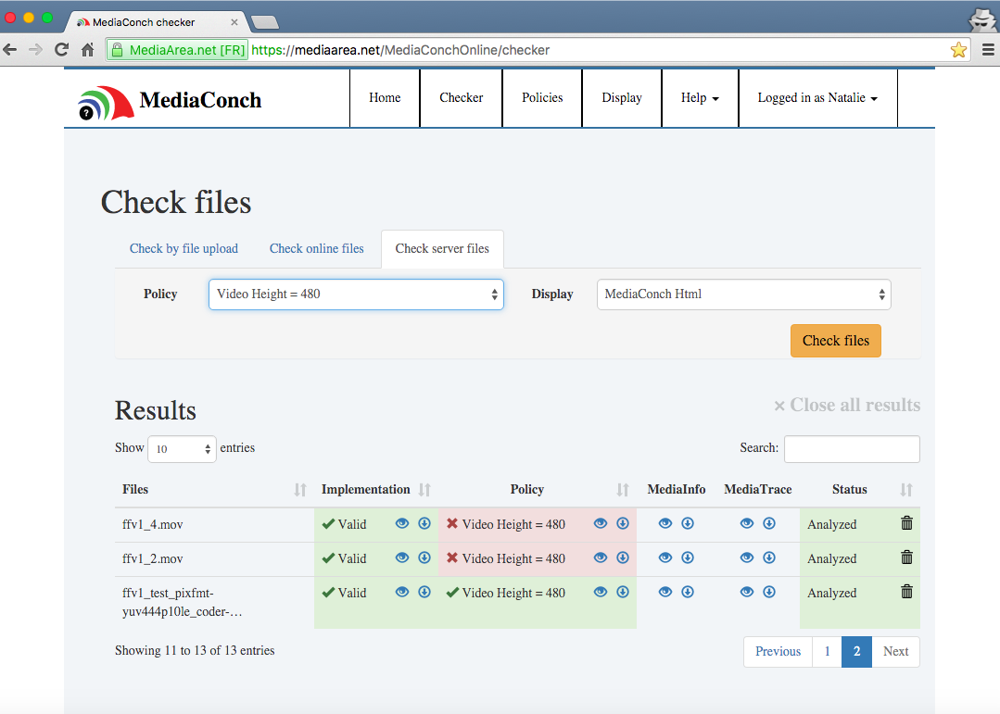
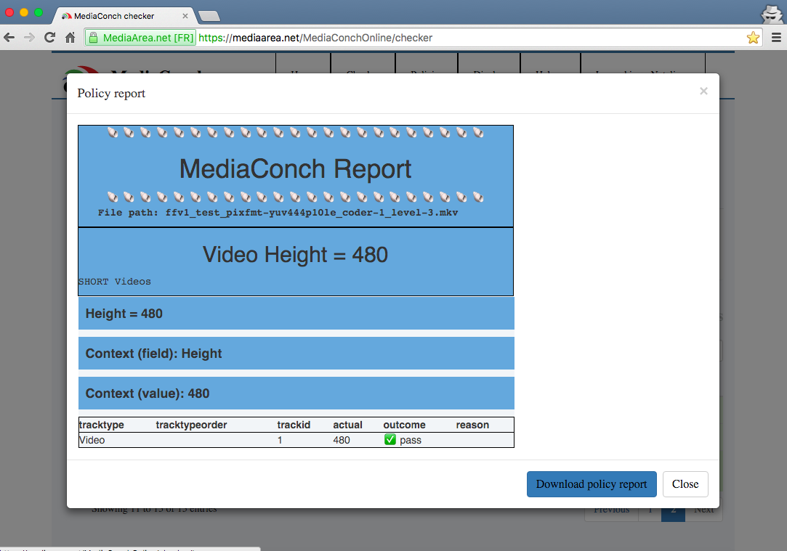
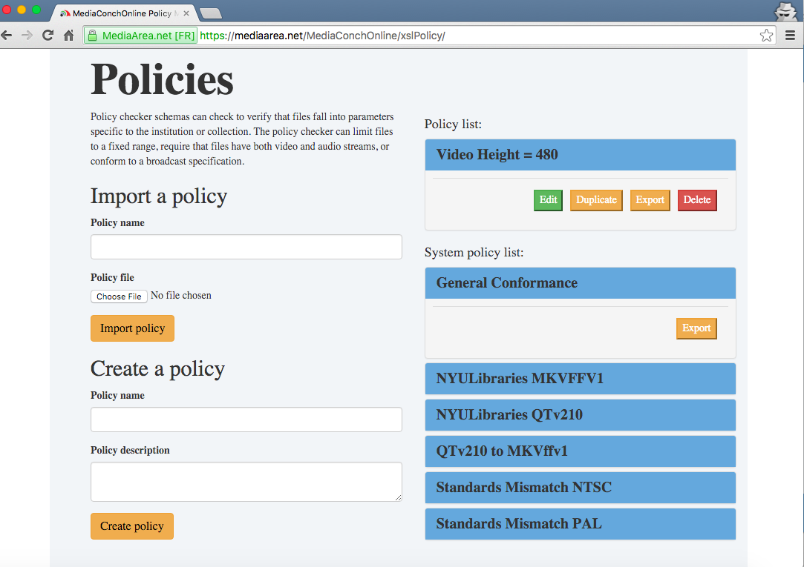

#How To Use

##Checking files with the Online GUI 
<ol type="1">
  <li>Go here for the latest version: [https://mediaarea.net/MediaConchOnline/checker](https://mediaarea.net/MediaConchOnline/checker)</li>
  <li>Register an account by creating  your username / password, which will be emailed to you with instructions. Then log in.</li>
  <li>Choose a policy</li>
  <li>Choose a file</li>
  <ul>
    <li>You can check a <a href="#check-local-file">local file</a> by selecting the “check file by upload” tab</li>
    <li>Choose one from <a href="#check-online-file">the Internet</a> by selecting the “check online files” tab, or</li>
    <li>Use the test files uploaded to the server by selecting the “check server files” tab</li>
  </ul>

  <li>Click “Check Files”</li>
  <li>Once checked, the results will appear below and you can see the reports for each section by clicking on the “eyecon”  (3rd screenshot) or download them by clicking the </li>
</ol>

Checker:

Policy Report:

Policies:

###MediaConch currently consists of three main sections: “Checker,” “Policies,” and “Display.”

##Checker
- [Check local file](#check-local-file)
- [Check online file](#check-online-file)
- [Check local folder](#check-local-folder)
- [Reporting](#reporting)
- [Policy Report](#policy-report)
- [Implementation Report](#implementation-report)
- [MediaInfo Report](#mediainfo-report)
- [MediaTrace Report](#mediatrace-report)
- [Exporting Reports](#exporting-reports)

##Policies
- [Type](#type)
- [Field](#field) 
- [Occurrence](#occurrence)
- [Validator](#validator)
- [Value](#value)
- [Free Text Mode](#free-text-mode)

##Display 
- [Import display set](#import-display-set)
- [Export display set](#export-display-set)
- [Delete selected display file](#delete-selected-display-file)

MediaConch currently consists of three main sections, "Checker," "Policies," and "Display."

##Checker

In the “Checker” section, files may be checked for conformance using policies defined by you. You may choose from either an existing policy in MediaConch, from an imported XSLT or Schematron policy file or you can create your own within the application.

Conformance Checker - General Overview

1. File has been produced according to the specifications of a standard file format
    - File matches the acceptance criteria for long-term preservation by a memory institution
2. Reports which properties deviate from the standard specification and acceptance criteria
    - In human and machine readable format
3. Performs automated fixes for simple deviations in the metadata of the preservation file. 

###Check local file

“Check local file” allows you to select a file or files from a local computer. You may choose from either an existing policy and you can open or drag/drop your own media into MediaConch to check a local file. Policy checks can be run by selecting the “Check files” button.

*Example*: /Users/mycomputer/mediafiles/ffv1.mkv

###Check online file

“Check online file” allows you to select a file using a URL path. You may choose from either an existing policy and display in MediaConch or from an imported XSLT or Schematron policy file. Please note that this feature supports the following application protocols: HTTP/HTTPS/FTP/FTPS. Policy checks can be run by selecting the “Check files” button.

*Example*: https://mediaarea.net/MediaConch/files/General_Conformance.mkv

###Check local folder

“Check local folder” allows you to select a folder of files from a local computer or volume. You may choose from either an existing policy and display in MediaConch or from an imported XSLT or Schematron policy file. Policy checks can be run by selecting the “Check files” button.

*Example*: /Users/mycomputer/mediafiles/

###Reporting

Once a file or files are checked, several conformance checking reports are generated. These reports are made viewable by clicking on the “eyecon” [eyecon][images/eyecon.png] next to each report.

###Policy Report

A policy report will declare whether a particular file is either wholly VALID or NOT VALID according to the prescribed policy tests. This policy test can either incorporate one of the pre-packaged templates available within MediaConch, or it can be tailored to fit the desired standards of the respective institution. One such alternative policy test would be to check that all video files conform to the same dimensions (1080p HD, 480p SD, etc.) as opposed to merely checking if the video file is free of digital decay. Ultimately, these reports can be as simplistic or elaborate as the needs of the institution in question. 

A file will only be considered VALID if all rules are found to be true. When declared NON VALID, a text-based Policy Report (FileName_PolicyReport.txt) will list all failed rules. This can also be exported as HTML and can be viewed either in-app or downloaded to use as preservation sidecar data.

###Implementation Report

An implementation report will declare whether a particular file is either VALID or NOT VALID according to specifications of Matroska, FFV1, and LPCM. Currently, a text-based Implementation Report (FileName_ConformanceReport.txt) will list a general readout of container and video streams, including whether a required field has either passed or failed specification.

###MediaInfo Report

In View Mode, you may navigate through an interactive directory tree structure representing the file created from a general MediaInfo report. This report may be exported as XML or HTML.

###MediaTrace Report

In View Mode, you may navigate through an interactive directory tree structure representing the file created from the MediaTrace report. Like MediaInfo’s general report, this report may be exported in XML or HTML and can be viewed either in-app or downloaded to use as preservation sidecar data.

User Note: When opening MediaTrace in View Mode, offsets will be addressed in hexadecimal, or “hex” notation. This differs from the MediaTrace XML output, which addresses offset in decimal notation.

###Exporting Reports

Reports can be downloaded by either clicking on the down arrow (↓) found directly to the right of each report, or by clicking on the “Download” button located at the bottom right of each report in View Mode.

##Policies

In the “Policies” section, you can create customized policy tests to check for conformance to a specific set of standards that your collection must adhere to. You can also import previously generated policy sets in either XSL or Schematron format.

Policy sets consist of individual rules and assertions. A policy may contain one or more rules, and rules may consist of one or more asserts. Rules and asserts typically contain a metadata field (e.g., “Format”), that field’s associated metadata stream type (e.g., “General), a validator (e.g., “is_equal), and a desired value (e.g., “Matroska”). Rules and asserts are automatically saved during creation, but you may duplicate or delete it using the associated buttons on each rule/assertion window.

For example, the following rule/assertion would ensure that all reported files must contain a frame rate associated with the NTSC broadcast standard:

- Type: General
- Field: FrameRate
- Validator: Equal
- Value: 29.970

###Create a Policy:

**1. Choose Type**

Allows you to select from a list of available metadata stream types. Video files are broken down into different “streams”, which you will select depending on the section of the video you are looking to create a policy for. These streams include General, Video, Audio, Image, Text, Menu, or Other. For example: if you are testing the dimensions in pixels, you’d want to choose “Video” because the Video stream represents all visual components of the overall video structure, including amount or size of pixels. since Video/Audio/General is the  most common. It may seem that the Image stream is an appropriate place to analyze the visual aspects of a video stream, but Image refers to still images attached to the video file only, such as an appended thumbnail.Image/text/menu/other are most likely going to be used in  edge cases only.

Example: *General*

**2. Choose Field**

Allows you to select from a list of associated fields. Fields vary according to what type of metadata stream is selected.

Example: *General/UniqueID*

**3. Select Occurence**

Allows you to select whether a rule occurs more than once in reportage.  

Example: *Occurrence:1*

**4. Choose Validator**

Validators for MediaConch include *is_equal*; *is_not_equal*; *is_greater than*; *is_less_than*; *is_greater_or_equal_than*; *is_less_or_equal_than*; *exists*; *does_not_exist*; *contains_string*.

**is_equal**: Requires the reported field value to be the same as the associated policy value.

Example: *General/Format is_equal to Matroska*

**is_not_equal**: Requires the reported field value to be different as the associated policy value.

Example: *General/Format is_not_equal to MPEG-4*

**is_greater than**: Requires the reported field value to be greater than the associated policy value.

Example: *General/Duration is_greater_than 1 mn*

**is_less_than**: Requires the reported field value to be less than the associated policy value.

Example: *Audio/Channels is_less_than 2 Channels*

**is_greater_or_equal_than**: Requires the reported field value to be greater or equal than the associated policy value.

Example: *Video/FrameCount is_greater_or_equal_than 1*

**is_less_or_equal_than**: Requires the reported field value to be less or equal than the associated policy value.

Example: *Video/FrameRate is_less_or_equal_than 29.970*

**exists**: Requires the reported field value to exist.

Example: *Video/Width_Original exists*

**does_not_exist**: Requires the reported field value to not exist.

Example: *Video/Width_CleanAperture does_not_exist*

**contains_string**: Requires the reported field value to contain an associated string.

Example: *General/CompleteName contains_string ffv1*

**5.Value**

This function allows you to select a desired value. When creating a value, do not include any associated strings (e.g., “pixels”).

**6. Bonues: Free Text mode

In addition to the Editor, policies may also be edited in Free Text mode. Free Text uses the XML Path Language (XPath). The following is an example of a MediaConch XPath expression in Free Text mode:
*track[@type='General']/FileExtension = 'mkv'*

Working within Free Text mode necessitates a high degree of skill within XPath and is only recommended for use by advanced users. 

##Display

The Display section will allow you to apply various display XSLs for use with policy and implementation check reports in the checker section. MediaConch has provided example HTML, XML and Text displays. Once a display XSL is imported, it can be instantly used by selecting the display in the “Choose a Display” dropdown menu when checking your files in the Checker section.

**Import display set**: Allows you to import a display XSL file to the display set.

**Export display set**: Allows you to export a display XSL file to the display set.

**Delete selected display file**: Allows you to delete a display XSL file from the display set.

##XML Reporting

This document describes four XML schemas designed by MediaArea for various types of file reportage. These schemas include the MediaInfo XML, the MediaConch XML, the MediaTrace XML, and the MediaAreaXML (MAXML). Brief descriptions of structure and operation can be found below.

**MediaInfo XML**
    - [Structure of a MediaInfo XML](https://mediaarea.net/MediaConch/documentation/DataFormat.html#structure-of-a-mediainfo-xml)
    - [Generating a MediaInfo XML](https://mediaarea.net/MediaConch/documentation/DataFormat.html#generating-a-mediainfo-xml)
    
**MediaConch XML**
    - [Structure of a MediaConch XML](https://mediaarea.net/MediaConch/documentation/DataFormat.html#structure-of-a-mediaconch-xml)
    - [Generating a MediaConch XML](https://mediaarea.net/MediaConch/documentation/DataFormat.html#generating-a-mediaconch-xml)
    
**MediaTrace XML**
    - [Structure of a MediaTrace XML](https://mediaarea.net/MediaConch/documentation/DataFormat.html#structure-of-a-mediatrace-xml)
    - [Generating a MediaTrace XML](https://mediaarea.net/MediaConch/documentation/DataFormat.html#generating-a-mediatrace-xml)
    - [MediaTrace XML Schema](https://mediaarea.net/MediaConch/documentation/DataFormat.html#mediatrace-xml-schema)

**MediaArea XML**
    - [Structure of a MediaArea XML](https://mediaarea.net/MediaConch/documentation/DataFormat.html#structure-of-a-mediaarea-xml)
    - [Generating a MediaArea XML](https://mediaarea.net/MediaConch/documentation/DataFormat.html#generating-a-mediaarea-xml)
    - [MediaArea XML Schema](https://mediaarea.net/MediaConch/documentation/DataFormat.html#mediaarea-xml-schema)

##MediaInfo XML

Using MediaArea’s principal software, MediaInfo, the MediaInfo XML presents a file’s basic metadata elements in the form of easily intelligible sets of track and stream information. These track types may include but are not limited to, “General,” or general container information; “Video” track or stream information; “Audio” track or stream information; and “Timecode” or other ancillary information. Additional information on MediaInfo general reporting is available [here](https://mediaarea.net/en/MediaInfo).

###Structure of A MediaInfo XML

The root element of the MediaInfo XML exists as <Mediainfo>. A nested <File> sub-element containing a ref attribute specifies the path and filename of the file reported on. A <track> child element defines MediaInfo’s track types, including type and tracktypeorder attributes. Within <track> elements are various sub-child elements corresponding to associated field metadata. For example, a “General” track type element will include such sibling elements as <CompleteName>, <Format>, and <FileSize>; a “Video” track type element will include such sibling elements as <Width>,  <DisplayAspectRatio>, and  <ColorSpace>; an "Audio" track type element will include such sibling elements as  <Channels>,  <SamplingRate>, and  <ChannelLayout>; and so on, and so forth.

The following is an example of a MediaInfo XML General type track element containing the sub-child elements “Format,” “Format_profile,” and “Codec_ID”:

   <track type="General" tracktypeorder="0">
	<Complete_name>/Users/mycomputer//files/ffv1.mkv</Complete_name>
	<Format>MPEG-4</Format>
	<Format_profile>QuickTime</Format_profile>
	<Codec_ID>qt</Codec_ID>
	</track>`

###Generating a MediaInfo XML

A MediaInfo XML can be generated using the following tools and associated commands:

    - With MediaInfo: mediainfo --Output=XML file.mov
    - With MediaConch (CLI): mediaconch -mi -fx file.mov (-mi is for mediainfo and -fx is for xml format)
    - With MediaConch (GUI): Select View Mode in the MediaInfo tab from the resulting file Checker reports

##MediaConch XML

The MediaConch XML is designed specifically for file conformance checking using MediaArea’s MediaConch software, and contains reportage pertaining to a user-defined policy or policies. Additional information on MediaConch is available [here](https://mediaarea.net/MediaConch/).

###Structure of a MediaConch XML

The root element of the MediaConch XML exists as <MediaConch>, and initially contains a <policyChecks>element which encapsulates all policy rules. The <name> element denotes the title of the policy, while the<media> element contains the checked filename its associated path:

   <?xml version="1.0" encoding="UTF-8"?>
	<MediaConch xmlns="https://mediaarea.net/mediaconch" xmlns:mi="https://mediaarea.net/mediainfo" version="0.1">`
	<policyChecks>
	<name>Preservation Master File Recommendations - Matroska/FFV1</name>
	<media ref="/Users/mycomputer//files/ffv1.mkv">`

Within the element are individual rules that contain the name of the policy rule, the associated track type and field, a user-declared value, the reported or “actual” value, and a “pass” or “fail” outcome:
	<check name="General Format equals Matroska">
	<context field="Format" value="Matroska"/>
	<test tracktype="General" actual="Matroska" outcome="pass"/>
	</check>
	
###Generating a MediaConch XML

A MediaConch XML can be generated using the following tools and associated commands:
    - With MediaConch (CLI): mediaconch -mc -fx file.mov
    - With MediaConch (GUI): Select View Mode in the Policy Report tab from the resulting file Checker reports

##MediaTrace XML

The MediaTrace XML is a technical reporting tool that expresses the binary architecture of a file as interpreted by MediaArea’s principal software, MediaInfo. Additional information on MediaTrace is available [here](https://mediaarea.net/mediatrace/). A data dictionary is provided at the project’s Github repository [here](https://github.com/MediaArea/MediaAreaXml/blob/master/DataDictionary.md).

##Structure of a MediaTrace XML

This root element contains a `` sub-element denoting the version of MediaInfo’s library used in generating the trace report.

Many audiovisual formats are based on chunk-based storage where a block of data will either contain a data payload or other blocks. In QuickTime parlance these blocks are called atoms, in AVI “chunks”, and in Matroska, “elements”. MediaTrace will attempt to parse apart each block into subdivisions and report on their contents. Whether the source format specification calls it element, atom, chunk, or another term, MediaTrace will call it a<block>. In MediaTrace the contents of the block are called <data>:
   <block offset="28" name="DocType" info="matroska" size="11">
        <block offset="28" name="Header" size="3">
            <data offset="28" name="Name">642</data>
            <data offset="30" name="Size">8</data>
        </block>
        <data offset="31" name="Data">matroska</data>
     </block>`

###Generating a MediaTrace XML

A MediaTrace XML can be generated using the following tools and associated commands:
    - With MediaConch (CLI): mediaconch -mt -fx file.mkv
    - With MediaConch (GUI): Select Select View Mode in the MediaTrace tab from the resulting file Checker reports

###MediaTrace XML Schema
An XML Schema for MediaTrace is available [here](https://mediaarea.net/mediatrace/mediatrace.xsd).

##MediaArea XML

The MediaArea XML (MAXML) is designed to bundle general reporting information from MediaInfo, binary file architecture reporting from MediaTrace, and conformance checking information from MediaConch into one condensed XML structure.

###Structure of a MediaArea XML

The root element of the MediaArea XML is <MediaArea>, followed by a <media> sibling element. A <MediaInfo>child element defines a MediaInfo general report. Sibling <track type> elements offer various sub-child elements corresponding to associated field metadata.

###Generating a MediaArea XML

A MediaTrace XML can be generated using the following command:
mediaconch -mt -fx file.mkv

###MediaArea XML Schema
An XML Schema for MediaAreaXML is available [here](https://mediaarea.net/mediaarea/mediaarea_0_1.xsd).

